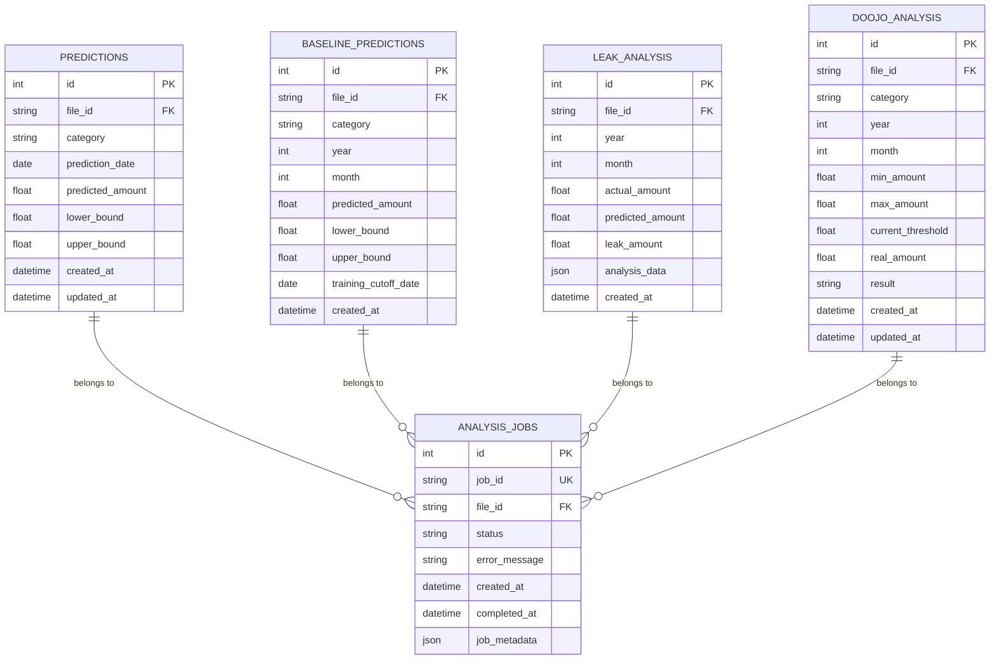

# 🚀 AI Fintech System - 지능형 금융 데이터 분석 플랫폼

## 📌 프로젝트 개요

**AI 기반 금융 거래 분석 및 예측 시스템**으로, 사용자의 거래 내역을 자동으로 분류하고 미래 지출을 예측하는 마이크로서비스 아키텍처 기반 플랫폼입니다.

### 핵심 가치
- 🎯 **정확한 거래 분류**: AI 기반 자동 카테고리 분류 (13개 카테고리)
- 📊 **지출 예측**: Facebook Prophet을 활용한 시계열 예측
- 📈 **베이스라인 분석**: 과거 11개월 소비 기준 금액 제공
- ⚡ **실시간 처리**: 비동기 대용량 데이터 처리
- 🔄 **확장 가능**: 마이크로서비스 아키텍처

## 🏗 시스템 아키텍처

```
┌─────────────────────────────────────────────────────────────┐
│                      Client Applications                    │
└──────────────────────────┬──────────────────────────────────┘
                          │
                          ▼ Port 8000
              ┌─────────────────────────┐
              │     API Gateway         │
              │   (통합 진입점/라우팅)    │
              └────┬────┬────┬──────────┘
                   │    │    │
      ┌────────────┴────┼────┴────────────┐
      │                 │                 │
      ▼                 ▼                 ▼
┌──────────┐      ┌──────────┐      ┌──────────┐
│Classifier│      │ Analysis │      │   CSV    │
│ Service  │      │ Service  │      │ Manager  │
│          │      │          │      │ Service  │
│  (GPT)   │      │(Prophet) │      │          │
└────┬─────┘      └────┬─────┘      └────┬─────┘
     │                 │                 │
     └─────────┬───────┴───────┬─────────┘
               │               │
        ┌──────▼──────┐ ┌──────▼──────┐
        │   MinIO/S3  │ │    Redis    │
        │  (Storage)  │ │   (Cache)   │
        └─────────────┘ └─────────────┘
               │
        ┌──────▼──────┐
        │ Azure MySQL │
        │  (Database) │
        └─────────────┘
```

## 📦 서비스 구성

### 1. **API Gateway** (Port: 8000)
- 통합 API 진입점
- 요청 라우팅 및 프록시
- Swagger UI 통합 제공
- 서비스 헬스 체크

### 2. **Classifier Service** (Port: 8001 - 내부)
- OpenAI GPT 기반 거래 분류
- 13개 지출 카테고리 자동 분류
- 배치 처리 최적화
- 정확도 95% 이상

### 3. **Analysis Service** (Port: 8002 - 내부)
- Facebook Prophet 시계열 예측
- 카테고리별 현재월 지출 예측
- 과거 11개월 베이스라인 계산
- 누수(초과 지출) 분석

### 4. **CSV Manager Service** (Port: 8003 - 내부)
- CSV 파일 업로드/관리
- 중복 파일명 허용 (고유 file_id 관리)
- MinIO/S3 통합
- Redis 기반 메타데이터 관리

## 🚦 상태 관리 시스템

### 3-State 시스템 (간소화됨)
```
┌──────────┐     ┌────────────┐     ┌──────┐
│ uploading│────▶│ analyzing  │────▶│ none │
└──────────┘     └────────────┘     └──────┘
```

| 상태 | 설명 | 다음 가능 상태 |
|------|------|--------------|
| `none` | 유휴 상태 (초기/완료) | `uploading`, `analyzing` |
| `uploading` | 파일 업로드 중 | `none` |
| `analyzing` | AI 분석 중 | `none` |

## 🎯 주요 API 엔드포인트

### 1. CSV 파일 관리
```bash
# 파일 업로드 (중복 파일명 허용)
POST /api/ai/csv/upload
Content-Type: multipart/form-data
file: transactions.csv

# 상태 확인
GET /api/ai/csv/status?file_id={file_id}

# 파일 삭제
DELETE /api/ai/csv/delete?file_id={file_id}

# 파일 교체
PUT /api/ai/csv/change?file_id={file_id}
```

### 2. 거래 분류
```bash
# 단일 거래 분류
GET /api/ai/classify?merchant=스타벅스&amount=4800

# 배치 분류 시작
POST /api/ai/classify/process?file_id={file_id}

# 분류 결과 조회
GET /api/ai/classify/result?file_id={file_id}
```

### 3. 지출 분석 및 예측
```bash
# 분석 시작 (현재월 + 11개월 베이스라인)
POST /api/ai/data?file_id={file_id}

# 현재월 예측 및 누수 조회
GET /api/ai/data/leak?file_id={file_id}&year=2024&month=12

# 과거 11개월 베이스라인 조회
GET /api/ai/data/baseline?file_id={file_id}
```

## 📊 베이스라인 예측 시스템

### 개념
**소비 기준 금액**: 현재월 기준 과거 11개월 각각에 대해, 해당 월 이전 데이터만 사용하여 계산한 예상 지출액

### 구현 방식
```python
# 예: 현재 12월인 경우
1월 베이스라인: 전년 12월까지 데이터로 1월 예측
2월 베이스라인: 1월까지 데이터로 2월 예측
...
11월 베이스라인: 10월까지 데이터로 11월 예측
12월 현재 예측: 11월까지 전체 데이터로 12월 예측
```

### 분석 프로세스 (순차 실행)
1. **현재월 예측 우선 계산 및 저장**
2. **과거 11개월 베이스라인 계산**

### API 응답 예시
```json
{
  "file_id": "abc-123-def-456",
  "baseline_months": [
    {
      "year": 2024,
      "month": 11,
      "total_predicted": 1100431.42,
      "categories_count": 13,
      "category_predictions": {
        "식비": {
          "predicted_amount": 450000,
          "lower_bound": 420000,
          "upper_bound": 480000
        }
      },
      "training_data_until": "2024-10-31"
    }
  ],
  "months_count": 11
}
```

## 📈 지원 카테고리 (13개)

| 카테고리 | 설명 | 예측 모델 특성 |
|---------|------|--------------|
| 식비 | 일반 식사 | 주간 계절성 강함 |
| 교통/차량 | 대중교통, 주유 | 월간 패턴 |
| 마트/편의점 | 생필품 구매 | 주간 패턴 |
| 온라인쇼핑 | 이커머스 | 이벤트 기반 |
| 카페/간식 | 카페, 디저트 | 주간 계절성 |
| 의료/건강 | 병원, 약국 | 비정기적 |
| 문화/여가 | 영화, 공연 | 주말 집중 |
| 생활 | 공과금, 통신 | 월간 고정 |
| 뷰티/미용 | 화장품, 미용실 | 월간 패턴 |
| 여행/숙박 | 호텔, 항공 | 계절성 |
| 교육 | 학원, 강의 | 분기별 |
| 술/유흥 | 주점, 클럽 | 주말 집중 |
| 기타 | 미분류 | 랜덤 |

## 🚀 Quick Start

### Prerequisites
- Docker & Docker Compose
- Python 3.11+
- 8GB+ RAM
- OpenAI API Key (필수)

### 1. 환경 설정
```bash
# .env 파일 생성
cp .env.example .env

# .env 파일 수정 (OpenAI API Key 필수)
OPENAI_API_KEY=sk-your-api-key-here
```

### 2. 시스템 시작
```bash
# 전체 서비스 시작
docker-compose up -d

# 또는 Makefile 사용
make up

# 상태 확인
docker-compose ps

# 로그 확인
docker-compose logs -f
```

### 3. API 접속
- **Swagger UI**: http://localhost:8000/api/ai/docs
- **ReDoc**: http://localhost:8000/api/ai/redoc
- **Health Check**: http://localhost:8000/api/ai/health

## 📝 API 사용 예시

### 전체 워크플로우
```bash
# 1. CSV 파일 업로드
curl -X POST "http://localhost:8000/api/ai/csv/upload" \
  -H "X-Admin-Token: admin-token" \
  -F "file=@transactions.csv"

# Response: {"file_id": "abc-123", "status": "uploading"}

# 2. 거래 분류 실행
curl -X POST "http://localhost:8000/api/ai/classify/process?file_id=abc-123" \
  -H "X-Admin-Token: admin-token"

# 3. 상태 확인 (분류 완료 대기)
curl "http://localhost:8000/api/ai/csv/status?file_id=abc-123" \
  -H "X-User-Token: user-token"

# 4. 예측 분석 시작
curl -X POST "http://localhost:8000/api/ai/data?file_id=abc-123"

# 5. 현재월 예측 결과 조회
curl "http://localhost:8000/api/ai/data/leak?file_id=abc-123"

# 6. 과거 11개월 베이스라인 조회
curl "http://localhost:8000/api/ai/data/baseline?file_id=abc-123"
```

### Python 예제
```python
import requests
from datetime import datetime

BASE_URL = "http://localhost:8000/api/ai"
headers = {"X-Admin-Token": "admin-token"}

# 1. CSV 파일 업로드
with open('transactions.csv', 'rb') as f:
    response = requests.post(
        f"{BASE_URL}/csv/upload",
        files={'file': f},
        headers=headers
    )
    file_id = response.json()['file_id']
    print(f"File uploaded: {file_id}")

# 2. 배치 분류 시작
response = requests.post(
    f"{BASE_URL}/classify/process?file_id={file_id}",
    headers=headers
)
print("Classification started")

# 3. 분석 시작
response = requests.post(
    f"{BASE_URL}/data?file_id={file_id}"
)
print("Analysis started")

# 4. 현재월 예측 결과 조회
response = requests.get(
    f"{BASE_URL}/data/leak?file_id={file_id}"
)
predictions = response.json()
print(f"Current month predictions: {predictions}")

# 5. 베이스라인 조회
response = requests.get(
    f"{BASE_URL}/data/baseline?file_id={file_id}"
)
baseline = response.json()
print(f"Baseline for {baseline['months_count']} months")
```

## 🗄 데이터베이스 ERD

### Entity Relationship Diagram



### 테이블 상세 설명

#### 1. **predictions** - 현재월 예측 데이터
```sql
CREATE TABLE predictions (
    id INT AUTO_INCREMENT PRIMARY KEY,
    file_id VARCHAR(255) NOT NULL,          -- CSV 파일 식별자
    category VARCHAR(100) NOT NULL,          -- 카테고리명
    prediction_date DATE NOT NULL,           -- 예측 날짜 (YYYY-MM-01)
    predicted_amount FLOAT,                  -- 예측 금액
    lower_bound FLOAT,                       -- 신뢰구간 하한
    upper_bound FLOAT,                       -- 신뢰구간 상한
    created_at TIMESTAMP DEFAULT CURRENT_TIMESTAMP,
    updated_at TIMESTAMP DEFAULT CURRENT_TIMESTAMP ON UPDATE CURRENT_TIMESTAMP,
    UNIQUE KEY uq_file_cat_date (file_id, category, prediction_date),
    INDEX idx_file_id (file_id)
);
```

#### 2. **baseline_predictions** - 과거 11개월 기준선 예측
```sql
CREATE TABLE baseline_predictions (
    id INT AUTO_INCREMENT PRIMARY KEY,
    file_id VARCHAR(255) NOT NULL,          -- CSV 파일 식별자
    category VARCHAR(100) NOT NULL,          -- 카테고리명
    year INT NOT NULL,                      -- 예측 연도
    month INT NOT NULL,                     -- 예측 월
    predicted_amount FLOAT,                  -- 예측 금액
    lower_bound FLOAT,                       -- 신뢰구간 하한
    upper_bound FLOAT,                       -- 신뢰구간 상한
    training_cutoff_date DATE,              -- 학습 데이터 마감일
    created_at TIMESTAMP DEFAULT CURRENT_TIMESTAMP,
    UNIQUE KEY uq_baseline_file_cat_year_month (file_id, category, year, month),
    INDEX idx_file_year_month (file_id, year, month)
);
```

#### 3. **leak_analysis** - 누수(초과지출) 분석
```sql
CREATE TABLE leak_analysis (
    id INT AUTO_INCREMENT PRIMARY KEY,
    file_id VARCHAR(255) NOT NULL,          -- CSV 파일 식별자
    year INT NOT NULL,                      -- 분석 연도
    month INT NOT NULL,                     -- 분석 월
    actual_amount FLOAT,                    -- 실제 지출액
    predicted_amount FLOAT,                  -- 예측 지출액
    leak_amount FLOAT,                      -- 누수 금액 (실제 - 예측)
    analysis_data JSON,                     -- 상세 분석 데이터
    created_at TIMESTAMP DEFAULT CURRENT_TIMESTAMP,
    UNIQUE KEY uq_file_year_month (file_id, year, month),
    INDEX idx_file_id (file_id)
);
```

#### 4. **doojo_analysis** - 두꺼비 조언(카테고리별 지출 달성) 분석
```sql
CREATE TABLE doojo_analysis (
    id INT AUTO_INCREMENT PRIMARY KEY,
    file_id VARCHAR(255) NOT NULL,          -- CSV 파일 식별자
    category VARCHAR(100) NOT NULL,          -- 카테고리명
    year INT NOT NULL,                      -- 분석 연도
    month INT NOT NULL,                     -- 분석 월
    min_amount FLOAT NOT NULL,              -- 12개월 최소 지출
    max_amount FLOAT NOT NULL,              -- 12개월 최대 지출
    current_threshold FLOAT NOT NULL,       -- 현재월 누수 기준
    real_amount FLOAT,                      -- 실제 사용 금액
    result VARCHAR(10),                     -- 'true'(누수) / 'false'(정상)
    created_at TIMESTAMP DEFAULT CURRENT_TIMESTAMP,
    updated_at TIMESTAMP DEFAULT CURRENT_TIMESTAMP ON UPDATE CURRENT_TIMESTAMP,
    UNIQUE KEY uq_doojo_file_cat_year_month (file_id, category, year, month),
    INDEX idx_file_category (file_id, category)
);
```

#### 5. **analysis_jobs** - 비동기 분석 작업 추적
```sql
CREATE TABLE analysis_jobs (
    id INT AUTO_INCREMENT PRIMARY KEY,
    job_id VARCHAR(255) UNIQUE NOT NULL,    -- 작업 고유 ID
    file_id VARCHAR(255) NOT NULL,          -- CSV 파일 식별자
    status VARCHAR(50) NOT NULL DEFAULT 'pending', -- pending/completed/failed
    error_message VARCHAR(1000),            -- 오류 메시지
    created_at TIMESTAMP DEFAULT CURRENT_TIMESTAMP,
    completed_at TIMESTAMP NULL,            -- 완료 시간
    job_metadata JSON,                      -- 작업 메타데이터
    INDEX idx_job_id (job_id),
    INDEX idx_file_id (file_id),
    INDEX idx_status (status)
);
```

### 데이터 흐름

1. **CSV 업로드** → file_id 생성
2. **분석 시작** → analysis_jobs 레코드 생성
3. **Prophet 분석 실행**:
   - predictions 테이블에 현재월 예측 저장
   - doojo_analysis 테이블에 두꺼비 조언 데이터 저장
   - leak_analysis 테이블에 누수 분석 저장
4. **Baseline 계산** → baseline_predictions에 11개월 데이터 저장
5. **분석 완료** → analysis_jobs 상태 업데이트

### 인덱스 전략

- **file_id**: 모든 테이블의 주요 검색 키
- **category**: 카테고리별 집계 쿼리 최적화
- **year, month**: 시계열 데이터 조회 최적화
- **Unique Constraints**: 중복 데이터 방지

## 📊 모니터링 & 로깅

### 헬스체크 엔드포인트
```bash
# Gateway 종합 헬스
GET /api/ai/health

# 서비스별 상태
GET /api/ai/services
```

### 로그 확인
```bash
# 전체 로그
docker-compose logs

# 특정 서비스 로그
docker-compose logs analysis -f

# Makefile 사용
make logs
```

## 🔧 트러블슈팅

### Redis 연결 문제
```bash
docker-compose restart redis
docker exec redis-cache redis-cli ping
```

### Azure MySQL 연결 문제
```bash
# Analysis 서비스 재시작
docker-compose restart analysis

# SSL 연결 확인
docker-compose logs analysis --tail 50
```

### MinIO 업로드 문제
```bash
# MinIO 콘솔 접속
http://localhost:9001
# ID: minioadmin / PW: minioadmin
```

### 전체 시스템 재시작
```bash
make down
make clean
make up
```

## 📈 성능 최적화

### 1. 병렬 처리
- ThreadPoolExecutor (4 workers)
- 카테고리별 독립 모델 학습
- 현재월 우선 처리 후 베이스라인 계산

### 2. 캐싱 전략
- Redis 기반 메타데이터 캐싱
- file_id를 primary key로 사용
- 상태 정보 실시간 업데이트

### 3. 데이터베이스 최적화
- 적절한 인덱싱
- 배치 삽입/업데이트
- 커넥션 풀링

## 🔒 보안

### 인증 시스템
- Admin Token: 관리 기능 (업로드, 삭제, 분류)
- User Token: 조회 기능
- 환경 변수로 토큰 관리

### API Key 보안
- OpenAI API Key 환경 변수 관리
- .env 파일 git ignore
- Docker secrets 권장

### 네트워크 보안
- 내부 서비스 격리
- Gateway만 외부 노출
- 서비스간 내부 통신

## 📚 기술 스택

### Backend
- **FastAPI**: 비동기 웹 프레임워크
- **Prophet**: Facebook 시계열 예측
- **OpenAI GPT-4**: 거래 분류
- **SQLAlchemy**: ORM

### Infrastructure
- **Docker & Docker Compose**: 컨테이너화
- **Azure MySQL**: 클라우드 기반 메인 데이터베이스 (SSL 연결)
- **Redis 7.0**: 캐시 & 상태 관리
- **MinIO**: S3 호환 파일 스토리지

### Libraries
- **Pandas & NumPy**: 데이터 처리
- **httpx**: 비동기 HTTP 클라이언트
- **pydantic**: 데이터 검증

## 🛠 개발 도구

### Makefile 명령어
```bash
make help        # 도움말
make up          # 서비스 시작
make down        # 서비스 중지
make restart     # 재시작
make logs        # 로그 확인
make clean       # 볼륨 정리
make test        # 테스트 실행
```

## 📁 프로젝트 구조

```
ai/
├── gateway/              # API Gateway
│   ├── app/
│   │   ├── core/        # 설정
│   │   ├── deps/        # 인증 의존성
│   │   └── main.py      # 메인 라우팅
│   └── requirements.txt
├── classifier/          # 거래 분류 서비스
│   ├── app/
│   │   ├── api/        # 엔드포인트
│   │   ├── services/   # GPT 서비스
│   │   └── models/     # 데이터 모델
│   └── requirements.txt
├── analysis/           # 예측 분석 서비스
│   ├── app/
│   │   ├── api/       # 엔드포인트
│   │   ├── services/  # Prophet 서비스
│   │   └── db/        # 데이터베이스
│   └── requirements.txt
├── csv-manager/        # CSV 관리 서비스
│   ├── app/
│   │   ├── api/       # 엔드포인트
│   │   ├── repos/     # 저장소 패턴
│   │   └── models/    # 스키마
│   └── requirements.txt
├── docker-compose.yml  # 오케스트레이션
├── Makefile           # 빌드 명령어
├── .env.example       # 환경 변수 템플릿
└── README.md          # 문서
```

