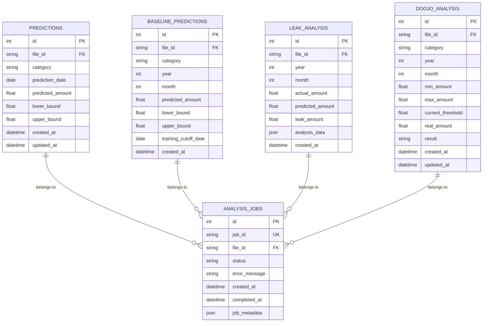

# 🚀 AI Fintech System - 지능형 금융 데이터 분석 플랫폼

## 📌 프로젝트 개요

**AI 기반 금융 거래 분석 및 예측 시스템**으로, 사용자의 거래 내역을 자동으로 분류하고 미래 지출을 예측하는 마이크로서비스 아키텍처 기반 플랫폼입니다.

### 핵심 가치
- 🎯 **정확한 거래 분류**: GPT-5-nano 기반 AI 자동 카테고리 분류 (13개 카테고리)
- 🧠 **고급 프롬프트 엔지니어링**: Structured Outputs, Chain of Thought, Few-shot Learning 적용
- 💬 **개인화된 금융 조언**: GPT-5-nano 기반 실시간 소비 패턴 분석 및 맞춤형 조언
- 📊 **지출 예측**: Facebook Prophet을 활용한 시계열 예측
- 📈 **베이스라인 분석**: 과거 11개월 소비 기준 금액 제공
- ⚡ **실시간 처리**: 비동기 대용량 데이터 처리
- 🔄 **확장 가능**: 마이크로서비스 아키텍처

## 🏗 시스템 아키텍처

```
┌─────────────────────────────────────────────────────────────┐
│                      Client Applications                    │
└──────────────────────────┬──────────────────────────────────┘
                          │
                          ▼ Port 8000
              ┌─────────────────────────┐
              │     API Gateway         │
              │   (통합 진입점/라우팅)    │
              └────┬────┬────┬──────────┘
                   │    │    │
      ┌────────────┴────┼────┴────────────┐
      │                 │                 │
      ▼                 ▼                 ▼
┌──────────┐      ┌──────────┐      ┌──────────┐
│Classifier│      │ Analysis │      │   CSV    │
│ Service  │      │ Service  │      │ Manager  │
│          │      │          │      │ Service  │
│(GPT-5n)  │      │(Prophet) │      │          │
└────┬─────┘      └────┬─────┘      └────┬─────┘
     │                 │                 │
     └─────────┬───────┴───────┬─────────┘
               │               │
        ┌──────▼──────┐ ┌──────▼──────┐
        │   MinIO/S3  │ │    Redis    │
        │  (Storage)  │ │   (Cache)   │
        └─────────────┘ └─────────────┘
               │
        ┌──────▼──────┐
        │ Azure MySQL │
        │  (Database) │
        └─────────────┘
```

## 📦 서비스 구성

### 1. **API Gateway** (Port: 8000)
- 통합 API 진입점
- 요청 라우팅 및 프록시
- Swagger UI 통합 제공
- 서비스 헬스 체크

### 2. **Classifier Service** (Port: 8001 - 내부)
- **OpenAI GPT-5-nano** 기반 거래 분류
- **Structured Outputs**: JSON Schema 준수 보장
- **Chain of Thought (CoT)**: 내부 추론 프로세스로 정확도 향상
- **Few-shot Learning**: 3개 예시로 컨텍스트 학습
- **Rule-based Post-processing**: 7개 브랜드 매칭 규칙
- 13개 한국 지출 카테고리 자동 분류
- 배치 처리 최적화
- 정확도 100% (테스트 기준)

**주요 기술:**
```python
# Structured Outputs with CoT
class TransactionClassificationWithCoT(BaseModel):
    reasoning: str        # 내부 추론 (API 응답에는 미포함)
    category: str
    subcategory: str
    confidence: float

# Enhanced System Prompt
- Role definition (전문 금융 분류 전문가)
- Rubric-based criteria (카테고리별 판단 기준)
- Few-shot examples (3개 예시)
- Brand matching rules (7개 규칙)
```

### 3. **Analysis Service** (Port: 8002 - 내부)
- **Facebook Prophet** 시계열 예측
- **GPT-5-nano 기반 금융 조언 생성**
  - 카테고리별 최다 지출 가맹점 분석
  - 최다 방문 가맹점 패턴 분석
  - 개인화된 한국어 조언 자동 생성
- 카테고리별 현재월 지출 예측
- 과거 11개월 베이스라인 계산
- 누수(초과 지출) 분석
- **두꺼비 조언 (doojo)**: S3 CSV 기반 지출 패턴 분석

### 4. **CSV Manager Service** (Port: 8003 - 내부)
- CSV 파일 업로드/관리
- 중복 파일명 허용 (고유 file_id 관리)
- MinIO/S3 통합
- Redis 기반 메타데이터 관리

## 🚦 상태 관리 시스템

### 4-State 시스템 (Redis 기반)
```
┌──────┐     ┌───────────┐     ┌───────────┐     ┌──────┐
│ none │────▶│ uploading │────▶│ ingesting │────▶│ none │
└──────┘     └───────────┘     └───────────┘     └──────┘
    │                                                  ▲
    └────────────▶ analyzing ─────────────────────────┘
```

| 상태 | 설명 | 다음 가능 상태 |
|------|------|--------------|
| `none` | 유휴 상태 (초기/완료) | `uploading`, `analyzing` |
| `uploading` | S3에 파일 업로드 중 | `ingesting` |
| `ingesting` | 데이터 처리 및 검증 중 | `none` |
| `analyzing` | Prophet AI 분석 실행 중 | `none` |

## 🎯 주요 API 엔드포인트

### 1. CSV 파일 관리
```bash
# 파일 업로드 (중복 파일명 허용)
POST /api/ai/csv/upload
Content-Type: multipart/form-data
file: transactions.csv

# 상태 확인
GET /api/ai/csv/status?file_id={file_id}

# 파일 삭제
DELETE /api/ai/csv/delete?file_id={file_id}

# 파일 교체
PUT /api/ai/csv/change?file_id={file_id}
```

### 2. 거래 분류 (GPT-5-nano)
```bash
# 단일 거래 분류 (Structured Outputs + CoT)
GET /api/ai/classify?merchant_name=스타벅스&amount=4800

# Response
{
  "category": "카페",
  "subcategory": "커피전문점",
  "confidence": 0.95
  # reasoning은 내부에서만 사용, 응답에는 미포함
}

# 배치 분류 시작
POST /api/ai/classify/process?file_id={file_id}

# 분류 결과 조회
GET /api/ai/classify/result?file_id={file_id}
```

### 3. 지출 분석 및 예측
```bash
# 분석 시작 (현재월 + 11개월 베이스라인)
POST /api/ai/data?file_id={file_id}

# 현재월 예측 및 누수 조회
GET /api/ai/data/leak?file_id={file_id}&year=2024&month=12

# 과거 11개월 베이스라인 조회
GET /api/ai/data/baseline?file_id={file_id}
```

### 4. 두꺼비 조언 (doojo) - GPT 기반 개인화 조언
```bash
# S3 CSV 기반 지출 패턴 분석 및 GPT 조언 생성
GET /api/ai/data/doojo?file_id={file_id}&year=2025&month=1

# Response
{
  "file_id": "abc-123",
  "doojo": [{
    "year": 2025,
    "month": 1,
    "categories_count": 5,
    "categories_prediction": {
      "카페": {
        "min": 50000,
        "max": 120000,
        "current": 82000,    # 평균값 기준
        "real": 75000,
        "result": false,     # 예산 초과 여부
        "avg": 82000
      }
    },
    "categories_detail": {
      "카페": {
        "most_spent": {
          "merchant": "스타벅스",
          "amount": 12000,
          "date": "2025-01-15",
          "msg": "다음 달 스타벅스 지출을 월 2만 원 이하로 제한하고..."  # GPT 생성
        },
        "most_frequent": {
          "merchant": "이디야",
          "count": 8,
          "total_amount": 32000,
          "msg": "이디야 방문을 주 2회로 줄이고 집에서 만든 커피로..."  # GPT 생성
        }
      }
    }
  }]
}
```

**doojo 특징:**
- ✅ **S3 CSV 기반**: MySQL 없이 순수 CSV 데이터만 사용
- ✅ **GPT-5-nano 조언**: 가맹점별 개인화된 한국어 조언 자동 생성
- ✅ **실시간 분석**: 카테고리별 min/max/avg 계산
- ✅ **월별 쿼리**: year/month 파라미터로 특정 월 분석

## 📊 베이스라인 예측 시스템

### 개념
**소비 기준 금액**: 현재월 기준 과거 11개월 각각에 대해, 해당 월 이전 데이터만 사용하여 계산한 예상 지출액

### 구현 방식
```python
# 예: 현재 12월인 경우
1월 베이스라인: 전년 12월까지 데이터로 1월 예측
2월 베이스라인: 1월까지 데이터로 2월 예측
...
11월 베이스라인: 10월까지 데이터로 11월 예측
12월 현재 예측: 11월까지 전체 데이터로 12월 예측
```

### 분석 프로세스 (순차 실행)
1. **현재월 예측 우선 계산 및 저장**
2. **과거 11개월 베이스라인 계산**

### API 응답 예시
```json
{
  "file_id": "abc-123-def-456",
  "baseline_months": [
    {
      "year": 2024,
      "month": 11,
      "total_predicted": 1100431.42,
      "categories_count": 13,
      "category_predictions": {
        "식비": {
          "predicted_amount": 450000,
          "lower_bound": 420000,
          "upper_bound": 480000
        }
      },
      "training_data_until": "2024-10-31"
    }
  ],
  "months_count": 11
}
```

## 📈 지원 카테고리 (13개)

| 카테고리 | 하위 카테고리 예시 | 예측 모델 특성 |
|---------|-------------------|--------------|
| 식비 | 한식, 중식, 일식, 양식, 분식, 패스트푸드, 배달음식 | 주간 계절성 강함 |
| 카페 | 커피전문점, 디저트카페, 베이커리 | 주간 패턴 |
| 마트/편의점 | 대형마트, 편의점, 온라인마트 | 주간 패턴 |
| 문화생활 | 영화, 공연, 전시, 도서, 음악, 게임 | 주말 집중 |
| 교통/차량 | 대중교통, 택시, 주유, 주차, 통행료, 차량유지 | 월간 패턴 |
| 패션/미용 | 의류, 신발, 가방, 화장품, 미용실, 네일 | 월간 패턴 |
| 생활용품 | 가전제품, 가구, 생필품, 주방용품 | 비정기적 |
| 주거/통신 | 월세, 관리비, 전기, 가스, 수도, 인터넷, 휴대폰 | 월간 고정 |
| 건강/병원 | 병원, 약국, 건강검진, 의료용품 | 비정기적 |
| 교육 | 학원, 교재, 온라인강의, 학용품 | 분기별 |
| 경조사/회비 | 경조사, 모임회비, 기부 | 이벤트 기반 |
| 보험/세금 | 보험료, 세금, 연금 | 월간 고정 |
| 기타 | 미분류 | 랜덤 |

## 🚀 Quick Start

### Prerequisites
- Docker & Docker Compose
- Python 3.11+
- 8GB+ RAM
- GMS API Key (필수) - SSAFY GPT-5-nano 접근용

### 1. 환경 설정
```bash
# .env 파일 생성
cp .env.example .env

# .env 파일 수정 (GMS API Key 필수)
GMS_API_KEY=S13P22A409-xxxx-xxxx-xxxx-xxxxxxxxxxxx
GMS_BASE_URL=https://gms.ssafy.io/gmsapi/api.openai.com/v1
OPENAI_MODEL=gpt-5-nano
```

### 2. 시스템 시작
```bash
# 전체 서비스 시작
docker-compose up -d

# 또는 Makefile 사용
make up

# 상태 확인
docker-compose ps

# 로그 확인
docker-compose logs -f
```

### 3. API 접속
- **Swagger UI**: http://localhost:8000/api/ai/docs
- **ReDoc**: http://localhost:8000/api/ai/redoc
- **Health Check**: http://localhost:8000/api/ai/health

## 📝 API 사용 예시

### 전체 워크플로우
```bash
# 1. CSV 파일 업로드
curl -X POST "http://localhost:8000/api/ai/csv/upload" \
  -H "X-Admin-Token: admin-token" \
  -F "file=@transactions.csv"

# Response: {"file_id": "abc-123", "status": "uploading"}

# 2. 거래 분류 실행 (GPT-5-nano with Structured Outputs)
curl -X POST "http://localhost:8000/api/ai/classify/process?file_id=abc-123" \
  -H "X-Admin-Token: admin-token"

# 3. 상태 확인 (분류 완료 대기)
curl "http://localhost:8000/api/ai/csv/status?file_id=abc-123" \
  -H "X-User-Token: user-token"

# 4. 예측 분석 시작
curl -X POST "http://localhost:8000/api/ai/data?file_id=abc-123"

# 5. 현재월 예측 결과 조회
curl "http://localhost:8000/api/ai/data/leak?file_id=abc-123"

# 6. 과거 11개월 베이스라인 조회
curl "http://localhost:8000/api/ai/data/baseline?file_id=abc-123"

# 7. GPT 기반 개인화 조언 조회
curl "http://localhost:8000/api/ai/data/doojo?file_id=abc-123&year=2025&month=1"
```

### Python 예제
```python
import requests
from datetime import datetime

BASE_URL = "http://localhost:8000/api/ai"
headers = {"X-Admin-Token": "admin-token"}

# 1. CSV 파일 업로드
with open('transactions.csv', 'rb') as f:
    response = requests.post(
        f"{BASE_URL}/csv/upload",
        files={'file': f},
        headers=headers
    )
    file_id = response.json()['file_id']
    print(f"File uploaded: {file_id}")

# 2. 배치 분류 시작 (GPT-5-nano Structured Outputs)
response = requests.post(
    f"{BASE_URL}/classify/process?file_id={file_id}",
    headers=headers
)
print("Classification started with GPT-5-nano")

# 3. 분석 시작
response = requests.post(
    f"{BASE_URL}/data?file_id={file_id}"
)
print("Analysis started")

# 4. 현재월 예측 결과 조회
response = requests.get(
    f"{BASE_URL}/data/leak?file_id={file_id}"
)
predictions = response.json()
print(f"Current month predictions: {predictions}")

# 5. 베이스라인 조회
response = requests.get(
    f"{BASE_URL}/data/baseline?file_id={file_id}"
)
baseline = response.json()
print(f"Baseline for {baseline['months_count']} months")

# 6. GPT 기반 개인화 조언 조회
response = requests.get(
    f"{BASE_URL}/data/doojo?file_id={file_id}&year=2025&month=1"
)
doojo = response.json()
for category_detail in doojo['doojo'][0]['categories_detail'].values():
    print(f"최다 지출 조언: {category_detail['most_spent']['msg']}")
    print(f"최다 방문 조언: {category_detail['most_frequent']['msg']}")
```

## 🧠 AI 모델 상세

### 1. Classifier - GPT-5-nano with Advanced Prompting

#### Structured Outputs
```python
# OpenAI Structured Outputs 사용
response = client.beta.chat.completions.parse(
    model="gpt-5-nano",
    messages=messages,
    response_format=TransactionClassificationWithCoT,  # JSON Schema 강제
    max_completion_tokens=4000
)
```

#### Chain of Thought (CoT)
```python
# 내부 스키마 (추론 포함)
class TransactionClassificationWithCoT(BaseModel):
    reasoning: str        # "1. 가맹점명 분석: 스타벅스는..."
    category: str
    subcategory: str
    confidence: float

# 외부 스키마 (추론 제외)
class TransactionClassification(BaseModel):
    category: str
    subcategory: str
    confidence: float
```

#### Few-shot Learning (3 Examples)
```python
few_shot_examples = [
    {
        "input": {"merchant": "스타벅스", "amount": 4500},
        "output": {"category": "카페", "subcategory": "커피전문점"}
    },
    {
        "input": {"merchant": "CGV", "amount": 15000},
        "output": {"category": "문화생활", "subcategory": "영화"}
    },
    {
        "input": {"merchant": "이마트", "amount": 45000},
        "output": {"category": "마트/편의점", "subcategory": "대형마트"}
    }
]
```

#### Rule-based Post-processing (7 Rules)
```python
brand_rules = {
    "스타벅스|투썸플레이스|이디야": ("카페", "커피전문점"),
    "맥도날드|버거킹|롯데리아": ("식비", "패스트푸드"),
    "GS25|CU|세븐일레븐": ("마트/편의점", "편의점"),
    "올리브영|왓슨스|롭스": ("패션/미용", "화장품"),
    "CGV|메가박스|롯데시네마": ("문화생활", "영화"),
    "카카오T|타다|우버": ("교통/차량", "택시"),
    "쿠팡|마켓컬리|SSG닷컴": ("마트/편의점", "온라인마트")
}
```

### 2. Prophet - 시계열 예측
```python
model = Prophet(
    daily_seasonality=False,
    weekly_seasonality=True,
    yearly_seasonality=True,
    changepoint_prior_scale=0.05
)
```

### 3. GPT Message Generator - 개인화 조언
```python
# 간소화된 프롬프트로 gpt-5-nano 최적화
prompt = f"{category} 카테고리 '{merchant}'에 {count}회 방문해서 총 {amount:,.0f}원 썼어. 한 줄로 조언해줘 (반말, 이모지 없이)"

response = gms_client.chat.completions.create(
    model="gpt-5-nano",
    messages=[{"role": "user", "content": prompt}],
    max_completion_tokens=1000  # 충분한 토큰으로 응답 보장
)
```

**조언 생성 예시:**
- "다음 달 스타벅스 지출을 월 2만 원 이하로 제한하고, 필요하면 집에서 만든 커피나 대체 음료로 대체해봐."
- "다음엔 버거킹은 세트 말고 단품으로 주문하고 음료는 물로 바꿔서 지출을 줄여."

## 🗄 데이터베이스 ERD

### Entity Relationship Diagram



### 데이터 흐름

1. **CSV 업로드** → file_id 생성
2. **분석 시작** → analysis_jobs 레코드 생성
3. **Prophet 분석 실행**:
   - predictions 테이블에 현재월 예측 저장
   - doojo_analysis 테이블에 두꺼비 조언 데이터 저장 (S3 CSV 기반)
   - leak_analysis 테이블에 누수 분석 저장
4. **Baseline 계산** → baseline_predictions에 11개월 데이터 저장
5. **분석 완료** → analysis_jobs 상태 업데이트

## 📊 모니터링 & 로깅

### 헬스체크 엔드포인트
```bash
# Gateway 종합 헬스
GET /api/ai/health

# 서비스별 상태
GET /api/ai/services
```

### 로그 확인
```bash
# 전체 로그
docker-compose logs

# 특정 서비스 로그
docker-compose logs analysis -f

# Makefile 사용
make logs
```

## 🔧 트러블슈팅

### Redis 연결 문제
```bash
docker-compose restart redis
docker exec redis-cache redis-cli ping
```

### Azure MySQL 연결 문제
```bash
# Analysis 서비스 재시작
docker-compose restart analysis

# SSL 연결 확인
docker-compose logs analysis --tail 50
```

### MinIO 업로드 문제
```bash
# MinIO 콘솔 접속
http://localhost:9001
# ID: minioadmin / PW: minioadmin
```

### GPT-5-nano 토큰 문제
```bash
# gpt-5-nano는 reasoning token을 많이 사용
# max_completion_tokens을 1000 이상으로 설정 권장
# 시스템 프롬프트를 간소화하면 reasoning token 감소
```

### 전체 시스템 재시작
```bash
make down
make clean
make up
```

## 📈 성능 최적화

### 1. 병렬 처리
- ThreadPoolExecutor (4 workers)
- 카테고리별 독립 모델 학습
- 현재월 우선 처리 후 베이스라인 계산

### 2. 캐싱 전략
- Redis 기반 메타데이터 캐싱
- file_id를 primary key로 사용
- 상태 정보 실시간 업데이트

### 3. 데이터베이스 최적화
- 적절한 인덱싱
- 배치 삽입/업데이트
- 커넥션 풀링

### 4. AI 모델 최적화
- **Structured Outputs**: JSON 파싱 불필요, 에러율 감소
- **Few-shot Learning**: 컨텍스트 학습으로 정확도 향상
- **Rule-based Fallback**: GPT 실패 시 규칙 기반 분류
- **GPT-5-nano**: 빠른 응답 속도, 낮은 비용

## 🔒 보안

### 인증 시스템
- Admin Token: 관리 기능 (업로드, 삭제, 분류)
- User Token: 조회 기능
- 환경 변수로 토큰 관리

### API Key 보안
- GMS API Key 환경 변수 관리
- .env 파일 git ignore
- Docker secrets 권장

### 네트워크 보안
- 내부 서비스 격리
- Gateway만 외부 노출
- 서비스간 내부 통신

## 📚 기술 스택

### Backend
- **FastAPI**: 비동기 웹 프레임워크
- **Prophet**: Facebook 시계열 예측
- **OpenAI GPT-5-nano**: 거래 분류 및 조언 생성
  - Structured Outputs
  - Chain of Thought (CoT)
  - Few-shot Learning
- **SQLAlchemy**: ORM

### Infrastructure
- **Docker & Docker Compose**: 컨테이너화
- **Azure MySQL**: 클라우드 기반 메인 데이터베이스 (SSL 연결)
- **Redis 7.0**: 캐시 & 상태 관리
- **MinIO**: S3 호환 파일 스토리지

### Libraries
- **Pandas & NumPy**: 데이터 처리
- **httpx**: 비동기 HTTP 클라이언트
- **pydantic**: 데이터 검증
- **openai 1.55.3**: GPT-5-nano API 클라이언트

## 🛠 개발 도구

### Makefile 명령어
```bash
make help        # 도움말
make up          # 서비스 시작
make down        # 서비스 중지
make restart     # 재시작
make logs        # 로그 확인
make clean       # 볼륨 정리
make test        # 테스트 실행
```

## 📁 프로젝트 구조

```
ai/
├── gateway/              # API Gateway
│   ├── app/
│   │   ├── core/        # 설정
│   │   ├── deps/        # 인증 의존성
│   │   └── main.py      # 메인 라우팅
│   └── requirements.txt
├── classifier/          # 거래 분류 서비스
│   ├── app/
│   │   ├── api/        # 엔드포인트
│   │   ├── services/   # GPT-5-nano 서비스
│   │   │   └── classifier_service.py  # CoT + Structured Outputs
│   │   └── models/     # Pydantic 스키마
│   └── requirements.txt
├── analysis/           # 예측 분석 서비스
│   ├── app/
│   │   ├── api/       # 엔드포인트
│   │   │   └── endpoints/
│   │   │       └── data.py  # doojo + GPT 조언 생성
│   │   ├── services/  # Prophet 서비스
│   │   └── db/        # 데이터베이스
│   └── requirements.txt
├── csv-manager/        # CSV 관리 서비스
│   ├── app/
│   │   ├── api/       # 엔드포인트
│   │   ├── repos/     # 저장소 패턴
│   │   └── models/    # 스키마
│   └── requirements.txt
├── docker-compose.yml  # 오케스트레이션
├── Makefile           # 빌드 명령어
├── .env.example       # 환경 변수 템플릿
└── README.md          # 문서
```

## 🎓 주요 학습 포인트

### 1. 고급 프롬프트 엔지니어링
- **Structured Outputs**: API 응답 신뢰성 100% 보장
- **Chain of Thought**: 추론 과정으로 복잡한 분류 정확도 향상
- **Few-shot Learning**: 최소 예시로 컨텍스트 학습
- **Role-based Prompting**: 전문가 역할 부여로 품질 향상

### 2. 마이크로서비스 아키텍처
- Gateway 패턴으로 서비스 통합
- 서비스별 독립 배포 및 확장
- Redis 기반 상태 관리
- S3 호환 스토리지 통합

### 3. AI/ML 시스템 설계
- Prophet 시계열 예측
- GPT 기반 자연어 처리
- 배치 처리 최적화
- 모델 성능 모니터링

### 4. 실전 데이터 처리
- CSV 대용량 처리
- 비동기 작업 큐
- 캐싱 전략
- 에러 핸들링

---

**Version**: 2.0.0
**Last Updated**: 2025-10-01
**Maintainer**: SSAFY 13기 A409팀

