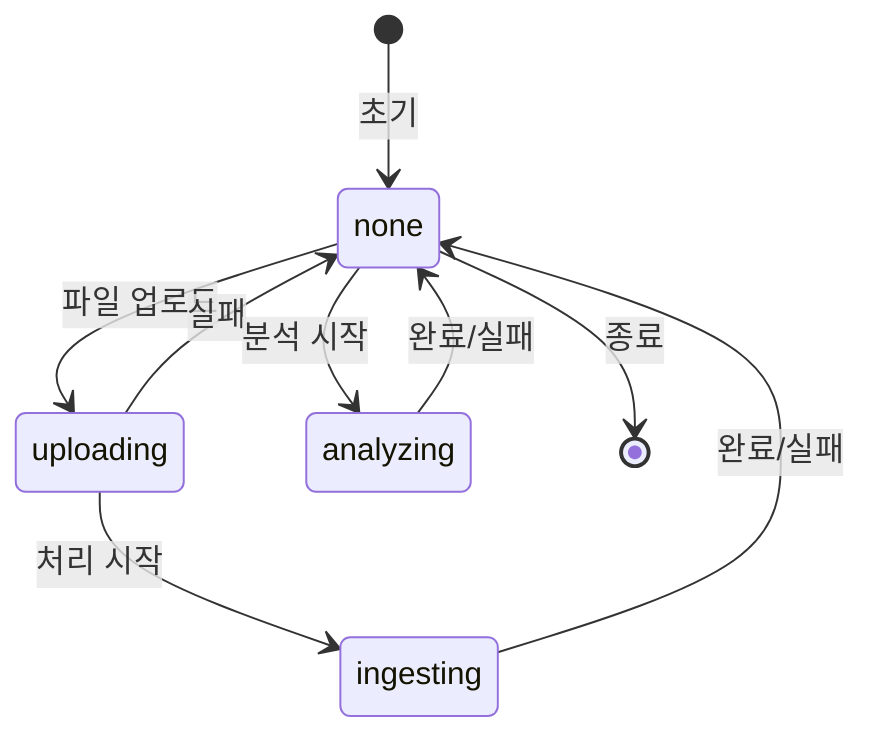

# 📊 Analysis Service - AI 기반 지출 예측 시스템

## 🎯 서비스 개요

Facebook Prophet을 활용한 **카테고리별 지출 예측 서비스**입니다. 사용자의 거래 내역을 분석하여 13개 카테고리별로 미래 지출을 예측하고, 데이터 기반 재무 인사이트를 제공합니다.

## ✨ 핵심 기능

### 1. **카테고리별 시계열 예측** 
- 13개 지출 카테고리 개별 분석
- 카테고리 특성에 맞춘 커스텀 계절성 모델
- 95% 신뢰구간 포함 예측값 제공

### 2. **비동기 대용량 처리**
- FastAPI BackgroundTasks 기반 논블로킹 처리
- ThreadPoolExecutor로 CPU 집약 작업 병렬화
- Redis 기반 실시간 상태 추적

### 3. **지능형 예측 모델**
- 카테고리별 맞춤형 Prophet 파라미터
- 주간/월간 계절성 자동 감지
- 이상치 및 트렌드 변화점 자동 조정

## 🏗 시스템 아키텍처

```
┌─────────────┐     ┌─────────────┐     ┌─────────────┐
│   Client    │────▶│  API Gateway│────▶│  Analysis   │
└─────────────┘     └─────────────┘     │   Service   │
                                        └──────┬──────┘
                                               │
                    ┌──────────────────────────┼──────────────────────────┐
                    ▼                          ▼                          ▼
            ┌─────────────┐            ┌─────────────┐            ┌─────────────┐
            │    Redis    │            │  PostgreSQL │            │   S3/MinIO  │
            │  (Status)   │            │ (Predictions)│           │   (Files)   │
            └─────────────┘            └─────────────┘            └─────────────┘
```

## 📁 프로젝트 구조

```
analysis/
├── app/
│   ├── api/
│   │   └── endpoints/
│   │       └── data.py          # API 엔드포인트
│   ├── db/
│   │   ├── database.py          # DB 연결 관리
│   │   └── models.py            # SQLAlchemy 모델
│   ├── services/
│   │   ├── prophet_service.py   # Prophet 예측 엔진
│   │   ├── redis_client.py      # Redis 상태 관리
│   │   └── s3_client.py         # S3 파일 처리
│   └── main.py                  # FastAPI 앱
├── Dockerfile
├── requirements.txt
└── README.md
```

## 🔄 상태 관리 시스템

### 단순화된 4-State 시스템

| 상태 | 설명 | 다음 가능 상태 |
|------|------|--------------|
| `none` | 유휴 상태 (초기/완료/실패) | `uploading`, `analyzing` |
| `uploading` | 파일 업로드 중 | `ingesting`, `none` |
| `ingesting` | 데이터 처리 중 | `none` |
| `analyzing` | Prophet 분석 중 | `none` |

### 상태 전이 다이어그램



### Redis 키 구조

```bash
csv:status:{file_id}          # 통합 상태 관리 (모든 서비스 공유)
csv:metadata:id:{file_id}     # CSV 파일 메타데이터
analysis:metadata:{file_id}   # 분석 결과/오류 정보 (TTL: 24시간)
```

## 🧠 Prophet 예측 엔진

### 카테고리별 최적화 전략

```python
# 식비/카페 - 강한 주간 패턴
if category in ['식비', '카페']:
    model = Prophet(
        weekly_seasonality=True,      # 주말/주중 패턴
        yearly_seasonality=False,      
        changepoint_prior_scale=0.1,   # 민감한 변화 감지
        interval_width=0.95            # 95% 신뢰구간
    )

# 교통비 - 월간 정기 패턴
elif category in ['교통/차량']:
    model = Prophet(
        weekly_seasonality=False,
        yearly_seasonality=False,
        changepoint_prior_scale=0.05    # 안정적 패턴
    )
    model.add_seasonality(
        name='monthly', 
        period=30.5, 
        fourier_order=5
    )

# 기타 카테고리 - 균형잡힌 설정
else:
    model = Prophet(
        weekly_seasonality=True,
        seasonality_mode='multiplicative',
        changepoint_prior_scale=0.05
    )
```

### 예측 프로세스

1. **데이터 준비**
   - 카테고리별 일일 지출 집계
   - 누락 날짜 0원으로 보충
   - 이상치 자동 처리

2. **모델 학습**
   - 카테고리별 독립 모델
   - 최소 2일 이상 데이터 필요
   - 병렬 처리로 성능 최적화

3. **예측 생성**
   - 현재월 & 다음월 예측
   - 과거 9개월 기준값 (Baseline) 예측
   - 상한/하한 신뢰구간
   - 트렌드 분석 (상승/하락/안정)

## 🎯 1월~현재 기준값 예측 (Baseline Predictions)

### 개념
**소비 기준 금액**: 가장 최근 1월부터 현재월까지 각 월별로 그 이전 데이터만 사용하여 계산한 예상 지출액
- 실제 지출과 비교하여 과소비/절약 판단 기준
- 시점별 데이터 격리로 과적합 방지
- 연간 소비 패턴 전체 추적 가능

### 구현 방식
```python
# 현재가 2025년 9월인 경우
for month in range(1, 9):  # 1월부터 8월까지
    target_month = month
    # 예: 8월 기준값 계산
    cutoff_date = datetime(2025, 7, 31)  # 7월 31일까지 데이터만 사용
    train_data = csv_data[csv_data['date'] <= cutoff_date]
    
    # 각 카테고리별로 Prophet 모델 학습
    for category in categories:
        model = train_prophet_model(train_data[category])
        august_prediction = model.predict(august_2025)
```

### 데이터 흐름 (현재: 9월)
```
1월 기준값 → 전년 12월까지 데이터로 1월 예측
2월 기준값 → 1월까지 데이터로 2월 예측
3월 기준값 → 2월까지 데이터로 3월 예측
...
8월 기준값 → 7월까지 데이터로 8월 예측  
9월 (현재) → 8월까지 데이터로 9월 예측
```

### 병렬 처리 최적화
```python
async def predict_with_baseline(csv_data):
    # 현재/미래 예측과 기준값 계산을 동시 실행
    current_future = loop.run_in_executor(executor, predict_current)
    baseline_future = loop.run_in_executor(executor, calculate_baseline)
    
    current_result = await current_future
    baseline_result = await baseline_future
    return combined_results
```

## 💾 데이터베이스 스키마

### Predictions 테이블
```sql
CREATE TABLE predictions (
    id SERIAL PRIMARY KEY,
    file_id VARCHAR(255) NOT NULL,
    category VARCHAR(100) NOT NULL,       -- 카테고리명
    prediction_date DATE NOT NULL,        -- 예측 대상 월
    predicted_amount NUMERIC NOT NULL,    -- 예측 금액
    lower_bound NUMERIC,                  -- 하한 신뢰구간
    upper_bound NUMERIC,                  -- 상한 신뢰구간
    created_at TIMESTAMP DEFAULT NOW(),
    UNIQUE(file_id, category, prediction_date)
);
```

### BaselinePrediction 테이블
```sql
CREATE TABLE baseline_predictions (
    id SERIAL PRIMARY KEY,
    file_id VARCHAR(255) NOT NULL,
    category VARCHAR(100) NOT NULL,       -- 카테고리명
    year INTEGER NOT NULL,                -- 기준 연도
    month INTEGER NOT NULL,               -- 기준 월
    predicted_amount NUMERIC NOT NULL,    -- 예측 금액
    lower_bound NUMERIC,                  -- 하한 신뢰구간
    upper_bound NUMERIC,                  -- 상한 신뢰구간
    training_cutoff_date DATE,            -- 학습 데이터 기준일
    created_at TIMESTAMP DEFAULT NOW(),
    UNIQUE(file_id, category, year, month)
);
```

### AnalysisJob 테이블
```sql
CREATE TABLE analysis_jobs (
    id SERIAL PRIMARY KEY,
    job_id VARCHAR(255) UNIQUE NOT NULL,
    file_id VARCHAR(255) NOT NULL,
    status VARCHAR(50) DEFAULT 'pending',
    job_metadata JSONB,                   -- 분석 결과 요약
    error_message TEXT,
    completed_at TIMESTAMP
);
```

## 🚀 API 사용 가이드

### 1. 분석 시작
```bash
POST /api/ai/data?file_id={file_id}

# 응답
{
    "file_id": "test-001",
    "year": 2025,
    "month": 9,
    "message": "Prophet analysis started. Job ID: abc-123"
}
```

### 2. 전체 카테고리 예측 조회
```bash
GET /api/ai/data/leak?file_id={file_id}&year=2025&month=9

# 응답
{
    "file_id": "test-001",
    "year": 2025,
    "month": 9,
    "details": {
        "total_predicted": 1058850.54,
        "categories_count": 13,
        "category_predictions": {
            "식비": {
                "predicted_amount": 228906.00,
                "lower_bound": 210543.00,
                "upper_bound": 247269.00
            },
            "교통/차량": {
                "predicted_amount": 106261.00,
                "lower_bound": 95635.00,
                "upper_bound": 116887.00
            }
            // ... 11개 카테고리 더
        },
        "next_month_prediction": {
            "year": 2025,
            "month": 10,
            "total_predicted": 1095430.00
        }
    }
}
```

### 3. 특정 카테고리 예측 조회
```bash
GET /api/ai/data/leak?file_id={file_id}&category=식비

# 응답
{
    "file_id": "test-001",
    "category": "식비",
    "details": {
        "predicted_amount": 228906.00,
        "lower_bound": 210543.00,
        "upper_bound": 247269.00,
        "trend": "stable"
    }
}
```

### 4. 기준값 조회 (1월~현재)
```bash
GET /api/ai/data/baseline?file_id={file_id}

# 응답 (현재가 9월인 경우)
{
    "file_id": "test-001",
    "baseline_months": [
        {
            "year": 2025,
            "month": 1,
            "total_predicted": 1100431.42,
            "categories_count": 13,
            "category_predictions": {
                "식비": {
                    "predicted_amount": 220000.00,
                    "lower_bound": 200000.00,
                    "upper_bound": 240000.00
                }
            },
            "training_data_until": "2024-12-31"  // 전년 12월까지 데이터로 1월 예측
        },
        {
            "year": 2025,
            "month": 2,
            "total_predicted": 1009359.16,
            "training_data_until": "2025-01-31"  // 1월까지 데이터로 2월 예측
        },
        // ... 3월~8월 (6개월 더)
    ],
    "months_count": 8  // 1월~8월 (9월은 현재이므로 제외)
}
```

### 5. 특정 카테고리 기준값 조회
```bash
GET /api/ai/data/baseline?file_id={file_id}&category=식비

# 응답: 식비 카테고리만 필터링된 1월~8월 기준값
```

### 6. 상태 확인
```bash
GET /api/ai/csv/status?file_id={file_id}

# 응답
{
    "csv_file": "transactions.csv",
    "status": "none",  # or "analyzing"
    "last_updated": "2025-09-18T10:30:00Z"
}
```

## 📊 기준값 예측 실제 결과 (1월~8월)

### 월별 총 예측액 추이 (현재: 9월)
| 연월 | 총 예측액 | 학습 데이터 기준 | 특징 |
|------|----------|-----------------|------|
| 2025-01 | 1,100,431원 | ~2024-12-31 | 새해 시작 |
| 2025-02 | 1,009,359원 | ~2025-01-31 | 설 명절 |
| 2025-03 | 1,141,506원 | ~2025-02-28 | 연초 지출 |
| 2025-04 | 1,021,196원 | ~2025-03-31 | 신학기 |
| 2025-05 | 1,025,717원 | ~2025-04-30 | 봄 시즌 |
| 2025-06 | 1,029,279원 | ~2025-05-31 | 안정기 |
| 2025-07 | 1,092,203원 | ~2025-06-30 | 상반기 마지막 |
| 2025-08 | 1,122,711원 | ~2025-07-31 | 여름 휴가철 |

### 활용 방안
1. **과소비 판단**: 실제 지출 > 기준값 = 과소비 신호
2. **트렌드 분석**: 기준값 변화로 소비 패턴 변화 감지
3. **예산 설정**: 기준값을 월별 예산 기준으로 활용

## 📈 분석된 카테고리 (13개)

| 카테고리 | 평균 월 지출 | 계절성 패턴 |
|---------|------------|-----------|
| 식비 | 228,906원 | 주간 (주말↑) |
| 교통/차량 | 106,261원 | 월간 (정기) |
| 마트/편의점 | 143,775원 | 주간 |
| 온라인쇼핑 | 73,141원 | 이벤트 |
| 카페/간식 | 84,543원 | 주간 |
| 의료/건강 | 63,214원 | 비정기 |
| 문화/여가 | 52,483원 | 주말 |
| 생활 | 83,216원 | 월간 |
| 뷰티/미용 | 42,567원 | 월간 |
| 여행/숙박 | 35,821원 | 계절 |
| 교육 | 95,234원 | 분기 |
| 술/유흥 | 28,945원 | 주말 |
| 기타 | 20,744원 | 랜덤 |

## ⚡ 성능 최적화

### 1. **병렬 처리**
- ThreadPoolExecutor (4 workers)
- 카테고리별 독립 모델 동시 학습
- 평균 처리 시간: 3-5초 (13개 카테고리)

### 2. **데이터베이스 최적화**
```sql
CREATE INDEX idx_predictions_file_category ON predictions(file_id, category);
CREATE INDEX idx_predictions_date ON predictions(prediction_date);
CREATE INDEX idx_jobs_file_id ON analysis_jobs(file_id);
```

### 3. **Redis 캐싱**
- TTL 24시간 자동 만료
- 상태 조회 O(1) 복잡도
- 메모리 효율적 관리

## 🔧 환경 설정

### 환경 변수 (.env)
```bash
# PostgreSQL
POSTGRES_HOST=postgres
POSTGRES_PORT=5432
POSTGRES_DB=fintech_ai
POSTGRES_USER=fintech
POSTGRES_PASSWORD=fintech123

# Redis  
REDIS_HOST=redis
REDIS_PORT=6379
REDIS_DB=0

# S3/MinIO
S3_ENDPOINT=http://minio:9000
S3_ACCESS_KEY=minioadmin
S3_SECRET_KEY=minioadmin
S3_BUCKET=csv-uploads

# Service
SERVICE_PORT=8002
LOG_LEVEL=INFO
```

### Docker 실행
```bash
# 개별 실행
docker build -t analysis-service .
docker run -p 8002:8002 --env-file .env analysis-service

# Docker Compose
docker-compose up -d analysis
```

## 🐛 트러블슈팅

### 문제: "No prediction data found"
```bash
# 해결: 분석 먼저 실행
POST /api/ai/data?file_id={file_id}
# 상태 확인 후 조회
GET /api/ai/csv/status?file_id={file_id}
```

### 문제: "Analysis already in progress"
```bash
# 해결: 상태가 none이 될 때까지 대기
while [ "$(curl -s /status | jq -r .status)" != "none" ]; do
  sleep 1
done
```

### 문제: 특정 카테고리 예측 실패
```bash
# 원인: 해당 카테고리 데이터 부족 (< 2일)
# 해결: 메타데이터에서 오류 확인
GET /api/ai/data/leak?file_id={file_id}
# response.details.category_predictions.{category}.error
```

## 📊 모니터링

### 헬스체크
```bash
GET /health

{
    "status": "healthy",
    "database": "connected",
    "redis": "connected",
    "version": "1.0.0"
}
```

### 메트릭
- 평균 응답 시간: < 100ms (조회)
- 분석 처리 시간: 3-5초
- 동시 처리 가능: 10개 파일
- 메모리 사용: < 512MB

## 🔮 향후 개선 계획

1. **고급 예측 기능**
   - 다변량 시계열 분석
   - 외부 경제 지표 연동
   - 개인화된 소비 패턴 학습

2. **실시간 알림**
   - 예산 초과 예측 시 알림
   - 비정상 지출 패턴 감지
   - 월말 지출 예측 리포트

3. **시각화 대시보드**
   - 카테고리별 트렌드 차트
   - 예측 정확도 추적
   - 지출 히트맵

## 📝 라이선스

MIT License - 자유롭게 사용 및 수정 가능

## 👥 기여 방법

1. Fork 후 feature 브랜치 생성
2. 변경사항 커밋
3. Pull Request 제출
4. 코드 리뷰 후 머지

---

**Built with ❤️ using Prophet, FastAPI, and PostgreSQL**